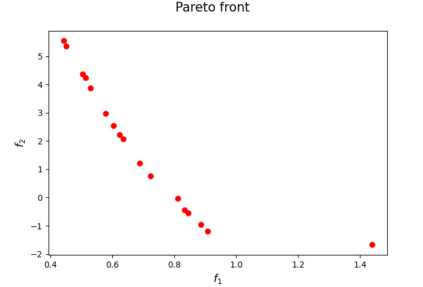
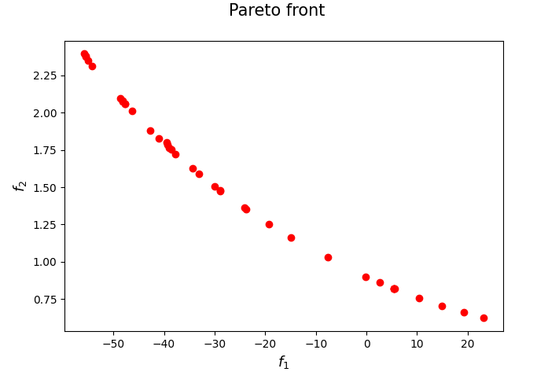

[](https://www.python.org/downloads/release/python-3106/)
[](https://opensource.org/licenses/Apache-2.0)
[](https://zenodo.org/badge/latestdoi/690490590)

<p>
  
   
</p>

## FRONT-ALAMO: Pareto front approximation through a multi-objective augmented Lagrangian method

Implementation of the FRONT-ALAMO Algorithm proposed in

[Cocchi, G., Lapucci, M. & Mansueto, P., Pareto front approximation through a multi-objective augmented Lagrangian method. EURO Journal on Computational Optimization (2021)](
https://doi.org/10.1016/j.ejco.2021.100008)

with the modification suggested in 

[Lapucci, M. & Mansueto, P., Improved front steepest descent for multi-objective optimization. Operations Research Letters (2023).](
https://doi.org/10.1016/j.orl.2023.03.001)

(The code of this last work can be found in [this GitHub folder](https://github.com/pierlumanzu/ifsd).)

If you have used our code for research purposes, please cite the publication mentioned above.
For the sake of simplicity, we provide the Bibtex format:

```
@article{COCCHI2021100008,
title = {Pareto front approximation through a multi-objective augmented Lagrangian method},
journal = {EURO Journal on Computational Optimization},
volume = {9},
pages = {100008},
year = {2021},
issn = {2192-4406},
doi = {https://doi.org/10.1016/j.ejco.2021.100008},
url = {https://www.sciencedirect.com/science/article/pii/S2192440621001350},
author = {Guido Cocchi and Matteo Lapucci and Pierluigi Mansueto},
keywords = {Multi-objective optimization, Augmented Lagrangian method, Pareto front approximation, Pareto stationarity, Global convergence},
}

```

### Main Dependencies Installation

In order to execute the code, you need an [Anaconda](https://www.anaconda.com/) environment and the Python package [nsma](https://pypi.org/project/nsma/) installed in it. For a detailed documentation of this framework, we refer the reader to its [GitHub repository](https://github.com/pierlumanzu/nsma).

For the package installation, open a terminal (Anaconda Prompt for Windows users) in the project root folder and execute the following command. Note that a Python version 3.10.6 or higher is required.

```
pip install nsma
```

##### Gurobi Optimizer

In order to run some parts of the code, the [Gurobi](https://www.gurobi.com/) Optimizer needs to be installed and, in addition, a valid Gurobi licence is required.

### Usage

In ```parser_management.py``` you can find all the possible arguments. Given a terminal (Anaconda Prompt for Windows users), an example of execution could be the following.

```python main.py --algs FRONT-ALAMO --probs LAP --max_time 2 --plot_pareto_front --plot_pareto_solutions --general_export --export_pareto_solutions```

### Contact

If you have any question, feel free to contact me:

[Pierluigi Mansueto](https://webgol.dinfo.unifi.it/pierluigi-mansueto/)<br>
Global Optimization Laboratory ([GOL](https://webgol.dinfo.unifi.it/))<br>
University of Florence<br>
Email: pierluigi dot mansueto at unifi dot it
